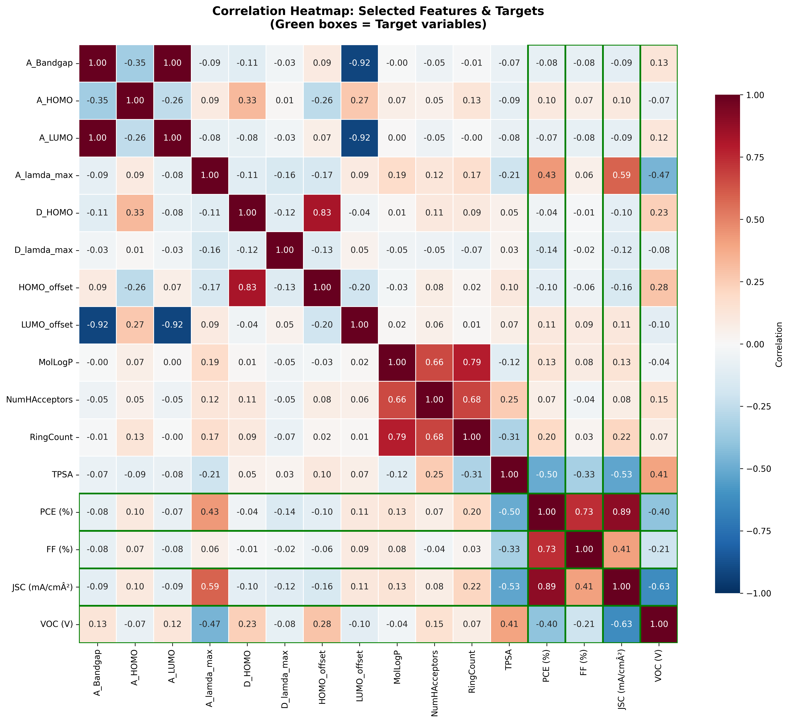
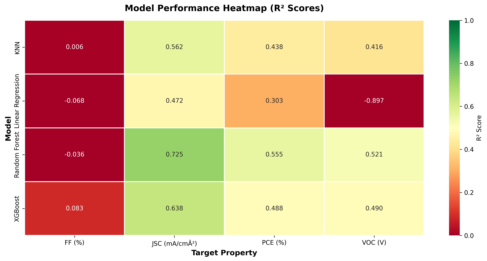
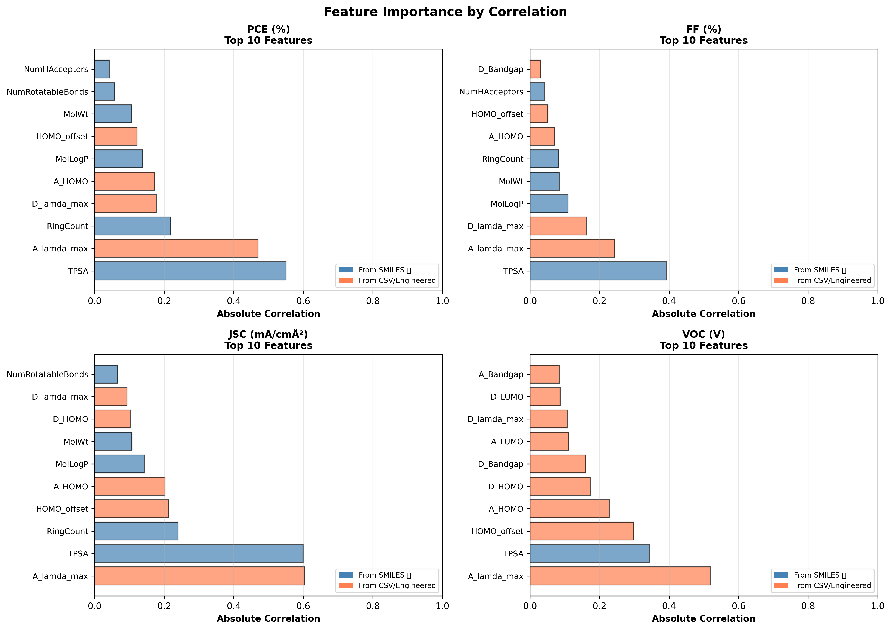
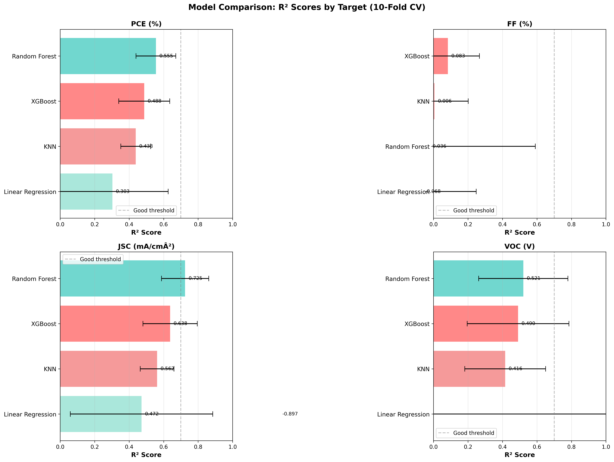
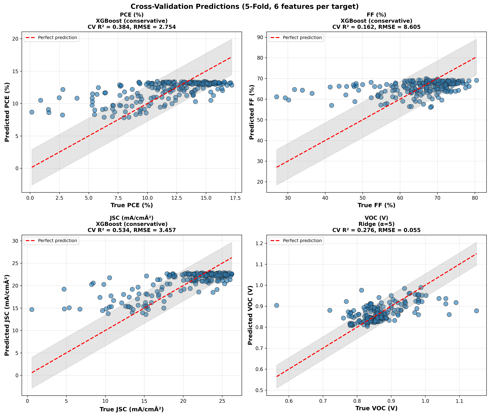

# OPV Property Prediction — ML from SMILES

Machine learning pipeline to predict **Organic Photovoltaic (OPV)** solar cell performance properties from donor–acceptor molecular pairs described by SMILES strings.

**The work is still in progress for increasing the size of the dataset for better results, the dataset was collected manually form experimental data (135 row used so far from 227, I used only systems with PCE between 8 and 17%)**

**Predicted targets:**
- **PCE (%)** — Power Conversion Efficiency
- **VOC (V)** — Open Circuit Voltage
- **JSC (mA/cm²)** — Short Circuit Current Density
- **FF (%)** — Fill Factor

---

## Project Structure

```
.
├── data/
│   ├── HTM_dataset_template.csv        # Raw dataset (donor–acceptor pairs + measured OPV properties)
│   ├── data_cleaned.csv                # Cleaned version of the dataset
│   ├── data_cleande_aromatic.csv       # Cleaned dataset filtered for aromatic systems
│   ├── data_aromatic_converted.csv     # Numeric-converted final training dataset
│   ├── new_molecules.csv               # New molecules to predict (input)
│   └── new_molecules_predictions.csv   # Prediction output for new molecules
│
├── scripts/
│   ├── aromatric.py             # Molecule filtering & aromaticity check
│   ├── diagnostic_data_check.py        # Data quality diagnostics
│   ├── enhanced_structural_features_FIXED.py  # RDKit feature extraction from SMILES + Ridge/XGBoost training
│   ├── heat_map_train_test_XGboost.py  # XGBoost train/test heatmap visualization
│   ├── models_comparaison.py           # Comparison: XGBoost vs Ridge vs RF vs KNN
│   ├── realistic_model_with_heatmap.py # Full pipeline for small datasets (63 samples) with cross-validation
│   ├── predict_properties.py           # Predict OPV properties for new molecules from saved models
│   └── smiles_png.py                   # Generate molecule images from SMILES using RDKit
│
├── models/
│   ├── opv_models_comparison.pkl       # Trained model comparison bundle
│   └── realistic_opv_models.pkl        # Best trained models (used for prediction)
│
├── outputs/
│   ├── molecule_images/                # PNG images of molecules (molecule_0001.png … )
│   ├── correlation_heatmap.png
│   ├── feature_correlations.png
│   ├── model_comparison_heatmap.png
│   ├── model_comparison_r2.png
│   ├── model_comparison_rmse.png
│   ├── model_performance_summary.png
│   └── realistic_predictions.png
```

---

## Workflow

```
Raw CSV (SMILES + measured OPV)
        │
        ▼
aromatric.py          ← filter molecules, check aromaticity
diagnostic_data_check.py     ← data quality check
        │
        ▼
enhanced_structural_features_FIXED.py  ← RDKit descriptors extraction → train models
realistic_model_with_heatmap.py        ← cross-validated training (small dataset)
        │
        ▼
models_comparaison.py        ← compare XGBoost / Ridge / RF / KNN
        │
        ▼
predict_properties.py        ← predict PCE, VOC, JSC, FF for new_molecules.csv
smiles_png.py                ← visualize molecule structures
```

---

## Requirements

```bash
pip install pandas numpy scikit-learn xgboost rdkit matplotlib seaborn
```

Or with conda:
```bash
conda install -c conda-forge rdkit
pip install xgboost scikit-learn pandas matplotlib seaborn
```

---

## Usage

### 1. Train models

```bash
python enhanced_structural_features_FIXED.py
# or, for small dataset with cross-validation:
python realistic_model_with_heatmap.py
```

### 2. Compare models

```bash
python models_comparaison.py
```

### 3. Predict new molecules

Edit `new_molecules.csv` with your donor SMILES and molecular properties, then:

```bash
python predict_properties.py
```

Output is saved to `new_molecules_predictions.csv`.

### 4. Visualize molecules

```bash
python smiles_png.py
```

PNG images are saved to `data/molecule_images/`.

---

## Dataset Format

The input CSV (`HTM_dataset_template.csv`) uses `;` as separator and contains:

| Column | Description |
|---|---|
| `D_Name` | Donor molecule name |
| `D_SMILES` | Donor SMILES string |
| `D_HOMO` / `D_LUMO` | Donor frontier orbital energies (eV) |
| `D_lamda_max` | Donor absorption max (nm) |
| `A_Name` | Acceptor molecule name |
| `A_HOMO` / `A_LUMO` | Acceptor frontier orbital energies (eV) |
| `A_lamda_max` | Acceptor absorption max (nm) |
| `VOC (V)` | Measured open circuit voltage |
| `JSC (mA/cm²)` | Measured short circuit current |
| `FF (%)` | Measured fill factor |
| `PCE (%)` | Measured power conversion efficiency |

---

## Features Extracted (from SMILES via RDKit)

- Molecular weight, LogP, TPSA
- Number of rings, aromatic rings, rotatable bonds
- H-bond donors/acceptors
- Fraction of sp3 carbons
- HOMO/LUMO gap (from input data)

---

## Models

| Model | Notes |
|---|---|
| **XGBoost** | Best performer on this dataset |
| Ridge Regression | Strong baseline, handles small datasets well |
| Random Forest | Ensemble baseline |
| KNN | Distance-based baseline |

Cross-validation: 5-fold KFold, metrics: R², RMSE, MAE.

---

## Results & Visualizations

### Correlation Heatmap


### Model Comparison — Heatmap


### Feature Correlations


### Model Comparison — R²


### Predictions vs Actuals


### Molecule Visualizations
Sample molecules from the dataset (generated with RDKit):


